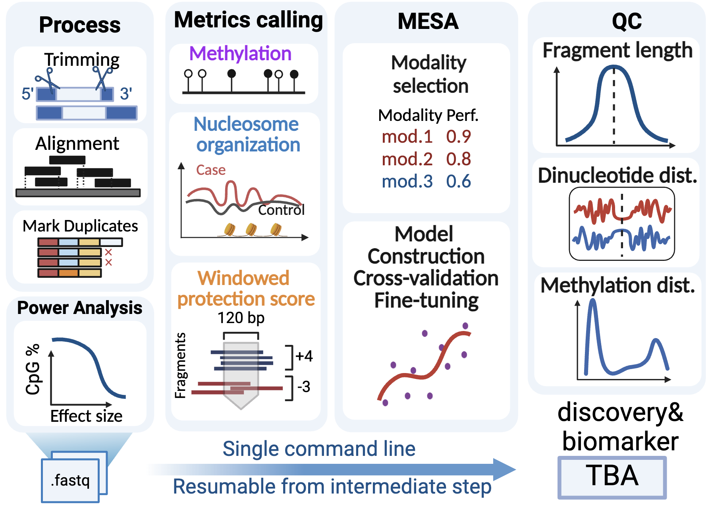

.. Circula documentation master file

Circula: an all-in-one command-line toolkit for cell-free DNA analysis
======================================================================

Circula is a command-line toolkit for cell-free DNA analysis. It is designed to be a one-stop solution for processing cell-free DNA data from raw FASTQ files to machine learning model for disease detection/prediction. Circula is built on top of popular or customized bioinformatics tools such as BWA, trim_galore, and MESA. It is designed to be easy to use, with a simple command-line interface that allows users to run the entire analysis pipeline with a single command, or run customized analysis with ease.

.. image:: https://readthedocs.org/projects/example-sphinx-basic/badge/?version=latest
    :target: https://example-sphinx-basic.readthedocs.io/en/latest/?badge=latest
    :alt: Documentation Status

Installation
------------

To use Circula, first install it using pip or conda:

.. code-block:: console

    $ pip install circula

OR

.. code-block:: console

    $ conda install -c conda-forge circula

Check out the document `Circula <https://circula.readthedocs.io/en/latest/>`_ for further information.

.. This README.rst should work on Github and is also included in the Sphinx documentation project in docs/ - therefore, README.rst uses absolute links for most things so it renders properly on GitHub
