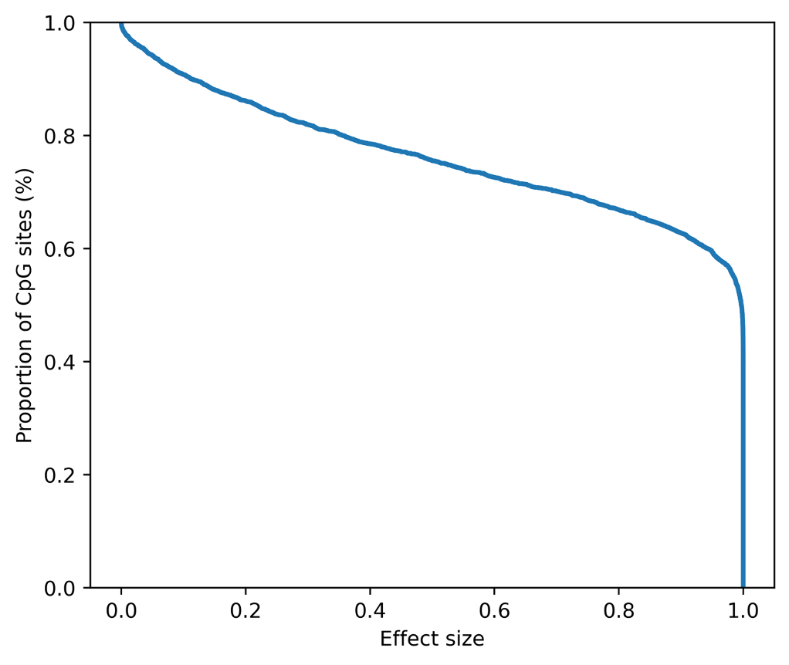

Process
==========

.. _installation:

Installation
------------

To use Circula, first install it using pip or conda:

.. code-block:: console

   $ pip install circula

OR

.. code-block:: console

   $ conda install -c conda-forge circula

Initial setup
-------------

To initialize a Circula program, use the ``circula init`` command. This command will create a new Circula project in the specified directory. The ``-r`` flag is required to specify the reference genome. The ``--ref-index`` and ``--ref-dict`` flags are optional and will create the reference genome index and dictionary files, respectively. ``--ref-index`` and ``--ref-dict`` flags are required for the alignment step and can be skipped if the reference genome index and dictionary files are already available at the directory enclosing the reference genome.

.. code-block:: bash

   circula init -r ${reference} --ref-index --ref-dict -o ./project_dir

All-in-one analysis example
---------------------------

After the initialization, you can run the entire analysis pipeline with a single ``process`` command. The ``-s`` flag is required to specify the processing steps and is customizable based on the user's needs.

1. Adapter trimmming (Trim Galore)
2. Genome alignment (bwa-meth)
3. Duplicate removal/marking (Picard)
4. Methylation extraction (MethylDackel)
5. Nuclosome occupancy calculation (DANPOS2)
6. Window protection score calculation

.. code-block:: bash

   circula process ${input_r1} ${input_r2} -s 1 2 3 4 5 6 
      --prefix 'test_S2' -@ 10
      --trimgalore-args '--clip_R1 10 --clip_R2 10 --three_prime_clip_R1 5 --three_prime_clip_R2 5'

Power analysis example
-----------------------
This power analysis tool is designed to estimate the sample size required to achieve a desired power level for a given effect size. The power analysis tool is based on the `Twist Human Methylome Panel <https://www.twistbioscience.com/products/ngs/fixed-panels/human-methylome-panel>`_ targets 3.98M CpG sites through 123 Mb of genomic content.
The follwing example shows how to estimate the power of biomarkers of 400 samples and a given effect size of 0.05. This command will output a power curve and a .tsv file containing the power analysis results.

.. code-block:: bash

   # Sample size=400, effect size=0.05, significance threshold= 2.7e-08
   circula power -o ./output -s 400 -e 0.05 --step-size 1000 -@ 10

   

To retrieve a list of random ingredients,
you can use the ``circula.get_random_ingredients()`` function:

.. autofunction:: circula.get_random_ingredients

.. autofunction:: circula.test_function

The ``kind`` parameter should be either ``"meat"``, ``"fish"``,
or ``"veggies"``. Otherwise, :py:func:`circula.get_random_ingredients`
will raise an exception.

.. autoexception:: circula.InvalidKindError

For example:

>>> import lumache
>>> lumache.get_random_ingredients()
>>> ['shells', 'gorgonzola', 'parsley']
>>>
>>
